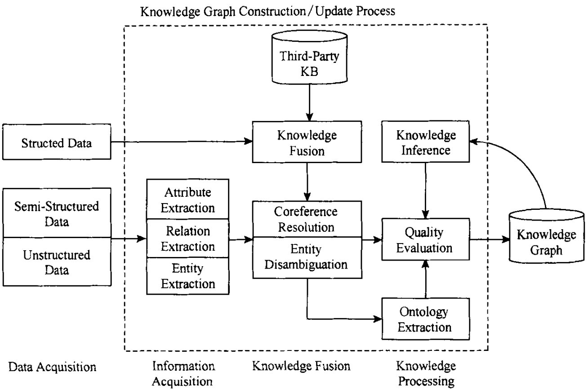

## 知识图谱的定义与架构
- 定义：结构化的语义知识库
- 架构
    - 逻辑结构
        - 数据层：知识以事实为单位存储在图数据库中，示例结构：“实体-关系-实体”、“实体-属性-属性值”。
        - 模式层：存储提炼后的知识。通常采用本体库来管理知识图谱的模式层，借助本体库对公理、规则和约束条件的支持能力来规范实体、关系以及实体的类型和属性等对象之间的联系。
    - 技术架构
      - 构建方式
        - 自顶向下: 借助百科类网站等结构化数据源，从高质量数据中提取本体和模式信息，加入到知识库中；所谓自底向上构建，则是 
        - 自底向上: 借助一定的技术手段，从公开采集的数据中提取出资源模式，选择其中置信度较高的新模式，经人工审核之后，加入到知识库中．
        

## 知识图谱的构建技术
- 信息抽取
  - 实体抽取
  - 关系抽取
    - 早期：通过人工构造语法和语言规则
    - 中期：有监督学习方法
    - 近期
      - 半监督方法：Bootstrapping 算法
      - 弱监督方法：Bootstrapping + N-Gram特征
      - 自监督方法：TextRunner
  - 属性抽取
    - 百科类网站的半结构化数据是实体属性抽取研究的主要来源:DBpedia
- 知识融合
  - 实体链接，分为三个步骤：
      1. 从文本中通过实体抽取得到实体指称项
      2. 进行实体消歧和共指消解
      3. 将实体指称项链接到知识库中对应实体
  - 知识合并
    - 合并外部知识库
    - 合并关系数据库
- 知识加工
  - 本体构建
    - 构建方式
      - 特定领域
        - 人工编辑
        - 计算机辅助->算法评估->人工审核
      - 开放领域：自动构建技术，分为三个阶段
        1. 实体并列关系相似度计算：模式匹配法、分布相似度法
        2. 实体上下位关系抽取：基于语法模式抽取IsA实体对、基于语义的迭代抽取技术
        3. 本体生成？
    - 本体库：Probase本体库
  - 知识推理
    - 基于逻辑的推理
      - 一阶谓词逻辑推理: (A, friend, B)
      - 描述逻辑的推理？
      - 基于规则的推理？
    - 基于图的推理
      - 基于神经网络模型
      - Path Ranking算法
  - 质量评估
- 知识更新

## 知识图谱的应用
- 基于信息检索的问答系统
  - [Jacana-Freebase系统](https://code.google.com/archive/p/jacana/)
  - [Paralex系统](http://knowitall.cs.washington.edu/paralex/)
  - 思路：
    1. 将问题转化为一个基于知识库的结构化查询
    2. 从知识库抽取与问题中实体相关的信息来生成多个候选答案
    3. 从候选答案中识别正确答案 
- 基于语义分析的问答系统
  - 案例：[Sempre系统](https://nlp.stanford.edu/software/sempre/)
  - 思路：
    1. 通过语义分析正确理解问题的含义
    2. 将问题转变为知识库的精确查询，直到找到正确答案
   
## 问题与挑战
- 信息抽取环节，面积开放域的信息抽取还在起步阶段
- 知识融合环节，如何实现准确的实体链接是一个主要挑战
- 知识加工环节？
- 知识更新环节：过于依赖人工干预

